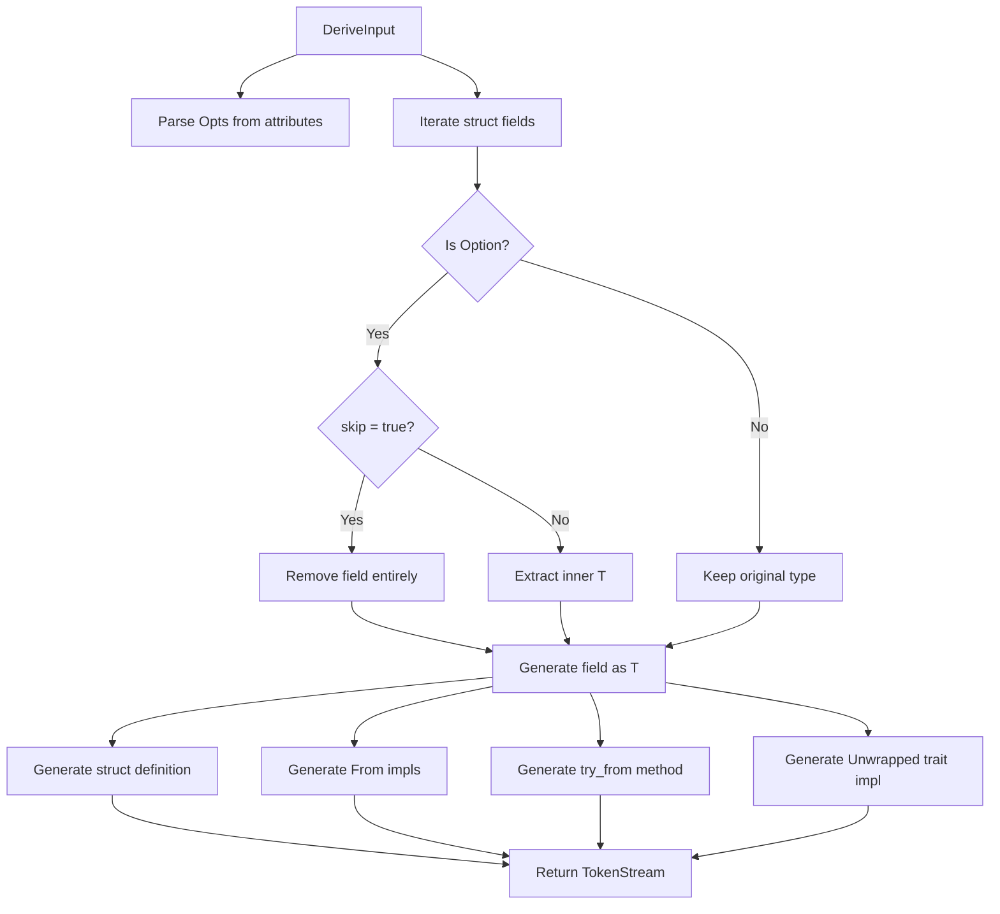

# Architecture

## Overview

The `unwrapped-core` crate contains the reusable core logic for generating unwrapped structs. It has no proc-macro dependencies, making it usable by other macro authors who want to generate unwrapped variants as part of their own macros.

## Design

The crate exposes a single entry point function `unwrapped()` that takes a parsed `DeriveInput` and configuration options, returning a `TokenStream` with the generated code.

### Key Components

- **`Opts`** - Struct-level configuration parsed from `#[unwrapped(...)]` attributes

  - `name` - Custom name for the generated struct
  - `prefix` - Prefix to add to the struct name
  - `suffix` - Suffix to add to the struct name
  - Uses `bon` for builder pattern: `Opts::builder().suffix(ident).build()`

- **`FieldOpts`** - Field-level configuration parsed from `#[unwrapped(...)]` attributes

  - `skip` - When true, the field is completely removed from the unwrapped struct. If any field has `skip`, `From` implementations are not generated.

- **`ProcUsageOpts`** - Runtime options for proc-macro authors

  - `fields_to_unwrap` - Map of field names to unwrap behavior overrides
  - `lib_holder_name` - Custom path for the `unwrapped` crate import

- **`unwrapped()`** - Core function that generates the `TokenStream`

## Code Generation

Given an input struct, the function generates:

1. **Unwrapped struct** with the derives configured via `Opts`
1. **`From<Unwrapped>` for Original** wrapping in `Some()`
1. **`Unwrapped` trait impl** associating types
1. **`try_from()` method** returning `UnwrappedError` on `None`

## Data Flow



## Skip Field Behavior

When a field has the `skip` attribute:
- The field is completely removed from the generated struct
- `From` trait implementations are **not generated** (bidirectional conversion is impossible without all fields)
- `#[derive(bon::Builder)]` is automatically added to make construction easier
- Only the struct definition, `Unwrapped` trait impl, and `try_from` method are generated

This allows creating partial struct variants where certain fields are intentionally excluded from the unwrapped version.

### Builder Pattern

When `skip` is used, the generated struct includes `#[derive(::bon::Builder)]`, providing a fluent builder API:

```rust
let unwrapped = MyStructUw::builder()
    .field_a(value1)
    .field_b(value2)
    .build();
```

This compensates for the missing `From` implementations and provides an ergonomic way to construct the partial structs.

## Naming Strategy

The `Opts::unwrapped_ident()` method determines the generated struct name:

1. Apply prefix + (name or original) + suffix
1. If result equals original name, append "Uw" suffix
1. Default suffix is "Uw" when no naming options provided

## Where Clause Handling

All impls preserve the original where clause; no additional trait bounds are introduced for defaults.
