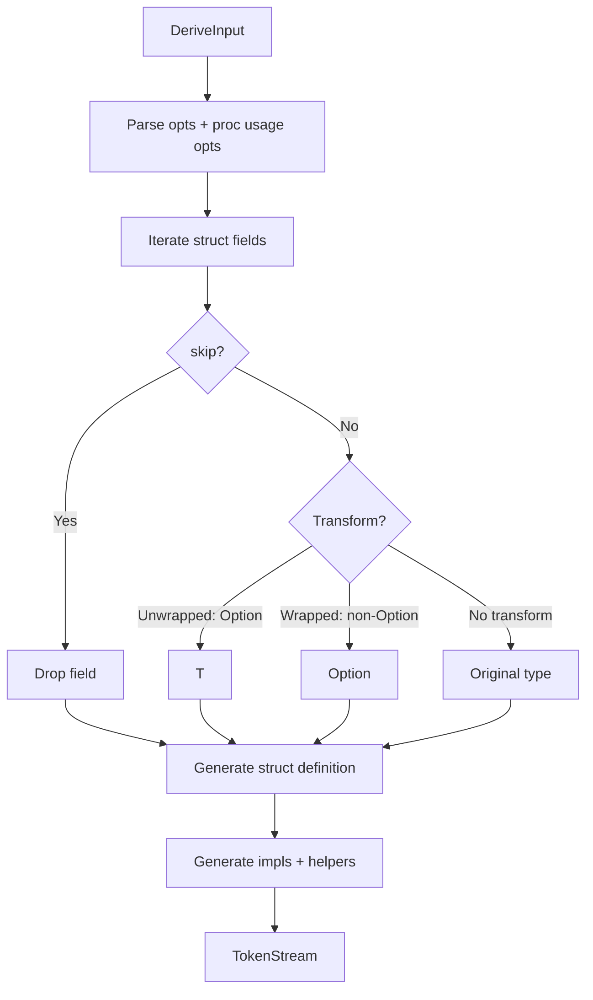

# Architecture

## Overview

The `unwrapped-core` crate contains reusable code generation logic for both `Unwrapped` and `Wrapped`. It has no proc-macro dependencies, making it usable by other macro authors who want to generate optionality variants as part of their own macros.

## Design

The crate is organized into three modules:

- **`unwrapped`** - Generates `Option<T> -> T` variants and related impls
- **`wrapped`** - Generates `T -> Option<T>` variants and related impls
- **`utils`** - Shared helpers for naming, attribute collection, Option detection, and bon builder integration

### Key Components

- **`Opts` / `WrappedOpts`** - Struct-level configuration parsed from `#[unwrapped(...)]` / `#[wrapped(...)]` attributes, plus builder-only options for custom derives and attributes
- **`UnwrappedProcUsageOpts` / `WrappedProcUsageOpts`** - Procedural options for macro authors, including per-field transform overrides, extra field attributes, and custom `unwrapped` crate paths
- **`CommonOpts` / `ProcUsageOpts`** - Shared configuration types used by both generators
- **`UnwrappedError`** - Used by fallible conversions when an `Option` field is `None`

## Code Generation

Given an input struct, the generator:

1. Parses struct-level options and procedural usage options
1. Iterates fields, applying `skip` and optional transforms
1. Collects field attributes from static options and dynamic callbacks
1. Generates the new struct definition
1. Generates trait impls and conversion helpers

### Transformation Rules

- **Unwrapped**

  - `Option<T>` becomes `T` when the field is selected for transformation
  - Non-`Option<T>` fields are left unchanged

- **Wrapped**

  - Non-`Option<T>` fields become `Option<T>` when selected for transformation
  - Existing `Option<T>` fields are left unchanged

### Conversions

- **Unwrapped**

  - `try_from(original)` is always generated and fails if any non-skipped `Option` field is `None`
  - `From<Unwrapped> for Original` is generated only when no fields are skipped
  - With skipped fields, an `into_original(self, skipped...)` helper is generated

- **Wrapped**

  - `From<Original> for Wrapped` and `try_from(wrapped)` are generated only when no fields are skipped
  - With skipped fields, an `into_original(self, skipped...) -> Result<Original, UnwrappedError>` helper is generated

## Skip Field Behavior

When a field has the `skip` attribute:

- The field is removed from the generated struct
- `From` implementations are omitted (field counts no longer match)
- `into_original` helpers are generated to reconstruct the original type
- If the input struct derives `bon::Builder` (or uses `#[builder(...)]`), the generator adds builder helpers:
  - `from_unwrapped(self, uw)` for Unwrapped
  - `from_wrapped(self, w)` for Wrapped (returns `Result`)

## Naming Strategy

The generated identifier is computed as:

1. `prefix + (name or original) + suffix`
1. If the result equals the original name, append the default suffix (`Uw` or `W`)

## Where Clause Handling

All impls preserve the original generics and where clause; no additional bounds are introduced.

## Data Flow

