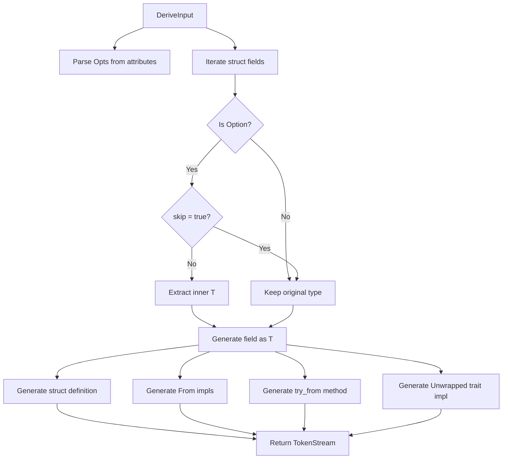

# Architecture

## Overview

The `unwrapped-core` crate contains the reusable core logic for generating unwrapped structs. It has no proc-macro dependencies, making it usable by other macro authors who want to generate unwrapped variants as part of their own macros.

## Design

The crate exposes a single entry point function `unwrapped()` that takes a parsed `DeriveInput` and configuration options, returning a `TokenStream` with the generated code.

### Key Components

- **`Opts`** - Struct-level configuration parsed from `#[unwrapped(...)]` attributes
  - `name` - Custom name for the generated struct
  - `prefix` - Prefix to add to the struct name
  - `suffix` - Suffix to add to the struct name
  - Uses `bon` for builder pattern: `Opts::builder().suffix(ident).build()`

- **`FieldOpts`** - Field-level configuration parsed from `#[unwrapped(...)]` attributes
  - `skip` - When true, the field remains `Option<T>` in the unwrapped struct

- **`ProcUsageOpts`** - Runtime options for proc-macro authors
  - `fields_to_unwrap` - Map of field names to unwrap behavior overrides
  - `lib_holder_name` - Custom path for the `unwrapped` crate import

- **`unwrapped()`** - Core function that generates the `TokenStream`

## Code Generation

Given an input struct, the function generates:

1. **Unwrapped struct** with `#[derive(Clone, Debug, Default)]`
2. **`From<Original>` for Unwrapped** using `unwrap_or_default()`
3. **`From<Unwrapped>` for Original** wrapping in `Some()`
4. **`Unwrapped` trait impl** associating types
5. **`try_from()` method** returning `UnwrappedError` on `None`

## Data Flow

## Naming Strategy

The `Opts::unwrapped_ident()` method determines the generated struct name:

1. Apply prefix + (name or original) + suffix
2. If result equals original name, append "Uw" suffix
3. Default suffix is "Uw" when no naming options provided

## Where Clause Handling

The `From<Original>` impl adds `Default` bounds for unwrapped `Option<T>` types to support `unwrap_or_default()`. Other impls preserve the original where clause.
